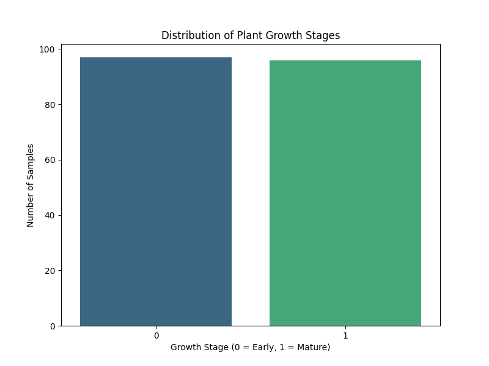
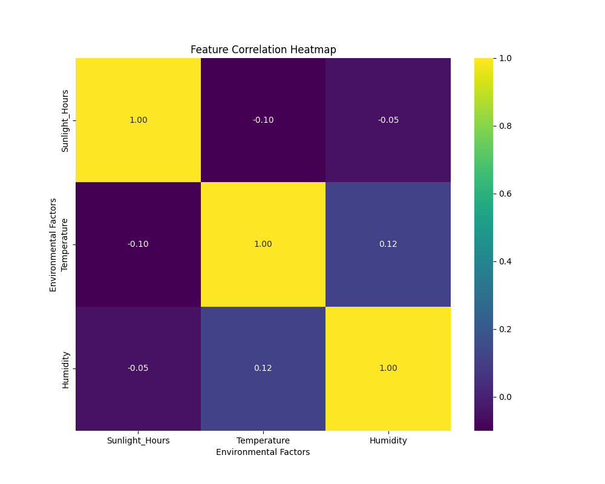
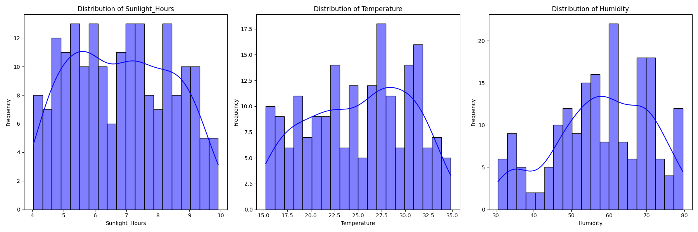
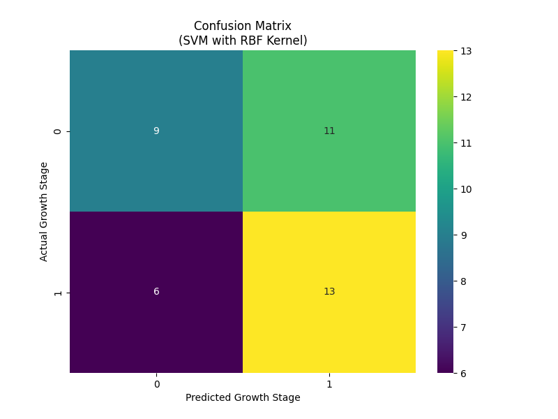
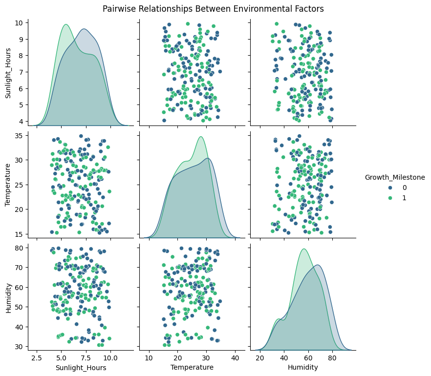
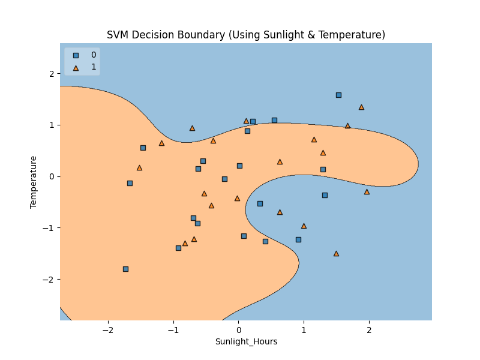

> # Abstract
> This study explores the relationship between environmental factors and plant growth stages using Exploratory Data Analysis (EDA) and Machine Learning (ML) models. Through visualizing feature distributions, correlations, and decision boundaries, we analyzed how Sunlight Hours, Temperature, and Humidity influence plant development. A Support Vector Machine (SVM) with an RBF kernel was employed to classify plants into early or mature growth stages, achieving an accuracy of 56%. The results indicate that while SVM effectively captures nonlinear relationships, misclassifications suggest that additional environmental variables may be necessary for improved accuracy. This analysis provides a foundation or future enhancements, such as incorporating more features, optimizing hyperparameters, or exploring alternative ML models like Random Forest or XGBoost, to create a more robust predictive system for plant growth classification.
>
> # Github Repository Link
> Here is the link to the Github repository where the Machine Learning script and it's resulting graphs are stored.   
> [Github repository: https://github.com/DJBlom/cu-boulder-ms-cs](https://github.com/DJBlom/cu-boulder-ms-cs)
>
> # Growth Stage Distribution
> ## Interpretation:
> The dataset is balanced, with almost an equal number of samples in both growth stages (early vs. mature). Implication: Since the dataset does not suffer from class imbalance, the model training should not be skewed towards one class.   
> 
> 
> # Feature Correlation Heatmap    
> ## Interpretation:    
> The heatmap shows low correlations between Sunlight Hours, Temperature, and Humidity.    
> 
> 
> ### Key Observations:    
> - Sunlight Hours vs. Temperature (-0.10 correlation): Almost no relationship.   
> - Temperature vs. Humidity (0.12 correlation): Very weak relationship.    
> - Sunlight Hours vs. Humidity (-0.05 correlation): Almost no correlation.   
> 
> ### Implication:     
> Since the environmental factors are mostly independent, the model must learn more complex, nonlinear patterns to predict growth stages.
> 
> # Feature Distributions
> ## Interpretation:
> The feature distribution plots provide insight into how Sunlight Hours, Temperature, and Humidity are spread across the dataset. Each feature follows a relatively continuous distribution, with Sunlight Hours peaking around 6-8 hours, Temperature clustering between 20-30°C, and Humidity showing a wider spread but concentrating around 50-70%. These distributions suggest that data preprocessing techniques like standardization were necessary to ensure fair model training. Additionally, the absence of clear bimodal distributions implies that growth stages are not easily separable based on individual features alone, reinforcing the need for a nonlinear model like SVM to capture complex interactions between variables.
>
> 
> 
> ### Key Observations:    
> - Sunlight Hours: Normally distributed with a peak around 6-8 hours.
> - Temperature: More spread out but peaks between 20-30°C.
> - Humidity: Wider spread, but clustering occurs around 50-70%.
> 
> ### Implication: 
> Since features are continuous and well-distributed, standardization (which we applied) was necessary for SVM.    
> 
> # SVM Confusion Matrix
> ## Interpretation:
> The confusion matrix reveals that while the SVM model correctly classifies many samples, misclassifications remain significant, particularly for early-stage plants being predicted as mature (11 instances). This suggests that the model struggles to differentiate between the two growth stages based on the given environmental factors. The overall balance of correct vs. incorrect classifications indicates that while the model captures some patterns, its predictive power is limited, likely due to missing key variables or the inherent complexity of plant growth. Further improvements, such as feature expansion and hyperparameter tuning, could help enhance classification accuracy.
>
> 
> 
> - Correct Predictions:     
>       9 samples correctly classified as Growth Stage 0 (Early).     
>       13 samples correctly classified as Growth Stage 1 (Mature).    
> - Misclassifications:    
>       11 early growth samples were wrongly classified as mature.    
>       6 mature growth samples were wrongly classified as early.    
> - Implication:     
>       The model is slightly biased toward predicting the mature stage correctly.     
>       Overall accuracy is around 56%, meaning improvements can still be made.     
> 
> # Feature Pairplot (Feature Relationships)
> ## Interpretation:
> The SVM decision boundary graph illustrates how the model separates plant growth stages based on Sunlight Hours and Temperature. The nonlinear shape of the boundary confirms that a simple linear model would not be effective for this dataset. The overlapping regions indicate areas where the model struggles to distinguish between early and mature growth stages, suggesting that other influential factors (such as soil composition or water levels) may be missing. While the RBF kernel helped capture complex relationships, further tuning or additional features could refine the boundary, leading to more precise classifications.
> 
> 
> The scatter plots show that data points for early vs. mature growth stages overlap significantly. No clear linear separation, confirming that a nonlinear model (like SVM with RBF kernel) is needed. Density plots (diagonal) suggest some difference in humidity and sunlight distributions across growth stages.    
> 
> ### Implication:
> - Since growth stages do not have clear boundaries, higher complexity models (like kernelized SVM) were required.    
> 
> # SVM Decision Boundary (Using Sunlight & Temperature)
> ## Interpretation:
> 
> 
> The nonlinear boundary confirms that RBF kernel is useful for handling this dataset. The decision regions are curved, showing that the relationship between sunlight, temperature, and growth stage is complex. Misclassified samples exist in overlapping regions, meaning additional factors (not included in the dataset) might also influence plant growth.
> 
> ### Implication:
> - SVM is capable of capturing complex patterns but may need further tuning or feature engineering to improve accuracy.    
> - Using all three features (including Humidity) in a 3D plot could improve decision visualization.   
> 
> # Overall Conclusion
> ## Findings:
> This project successfully explored the relationship between environmental factors and plant growth stages using Exploratory Data Analysis (EDA) and Machine Learning (ML) models. The results confirmed that growth stage classification is a nonlinear problem, requiring complex decision boundaries rather than simple linear separations.   
> 
> The Support Vector Machine (SVM) with an RBF kernel demonstrated its ability to capture these nonlinear patterns, achieving 56% accuracy. However, misclassifications indicate that additional features beyond Sunlight, Temperature, and Humidity may be necessary to improve prediction reliability. While SVM proved effective in modeling the dataset, further refinements—such as feature engineering, hyperparameter tuning, or exploring alternative models like Random Forest or XGBoost—could enhance its performance.
> 
> Ultimately, this study provided valuable insights into how environmental conditions influence plant growth, laying the groundwork for future improvements. By incorporating richer datasets and more advanced ML techniques, the accuracy and applicability of this predictive model can be significantly strengthened, making it a more powerful tool for agricultural decision-making and automation.    
> 
> # Next Steps for Improvement
> However, it's important to note that we can further improve the model's performance, a key focus should be on enhancing the dataset and refining the model selection process. Introducing additional environmental factors—such as soil nutrients, water content, and air quality—could provide deeper insights into plant growth, potentially leading to better predictions.     
> 
> Additionally, fine-tuning the SVM model by adjusting hyperparameters like C and gamma could refine its ability to distinguish growth stages. While SVM captured nonlinear relationships, experimenting with alternative models such as Random Forest or XGBoost may offer a better balance between accuracy and interpretability.
> 
> Finally, since Humidity was excluded from the decision boundary plot, implementing 3D visualizations could provide a more comprehensive view of how all three factors interact. Combining these improvements would likely lead to a more accurate and robust plant growth prediction model, capable of providing meaningful insights into the effects of environmental conditions.
