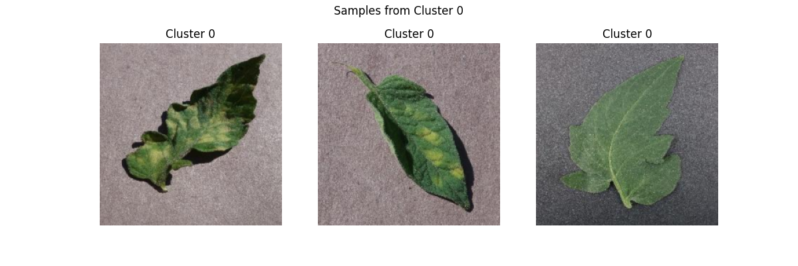
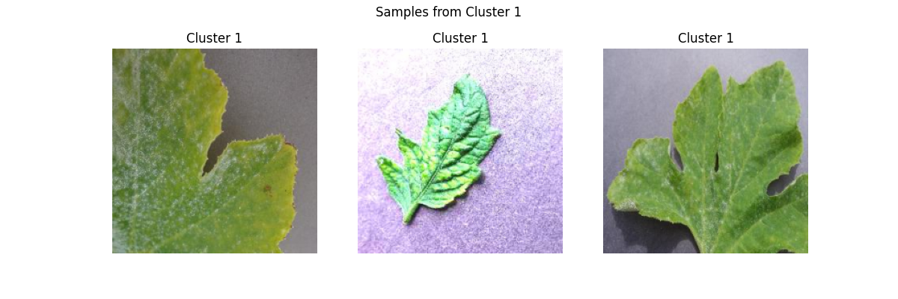
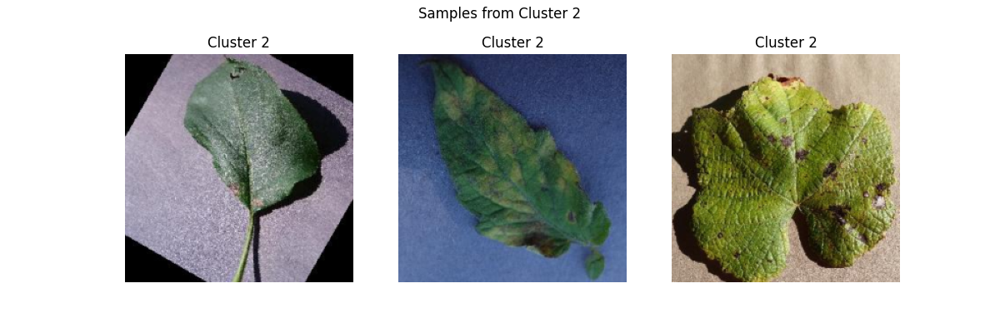
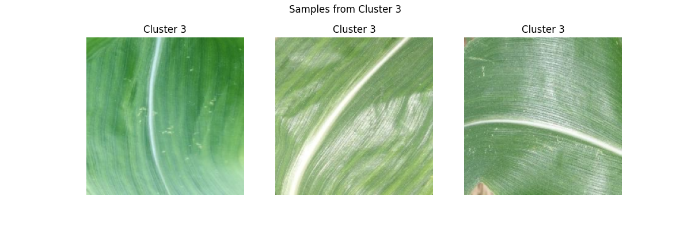
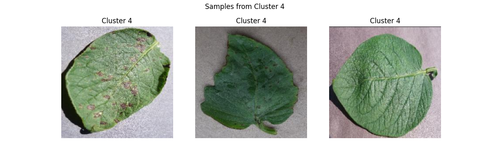
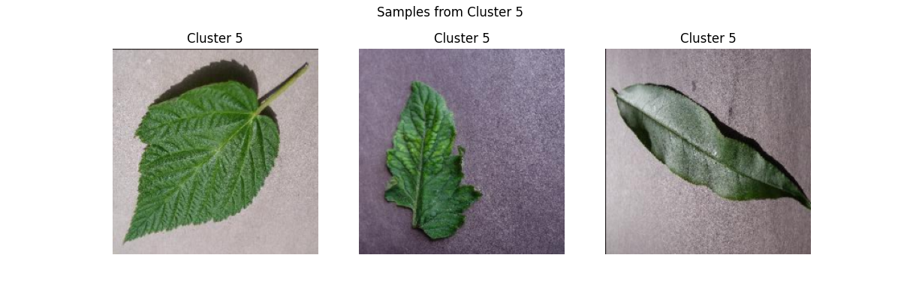
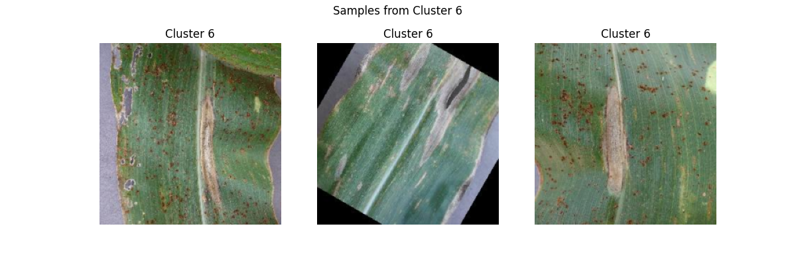
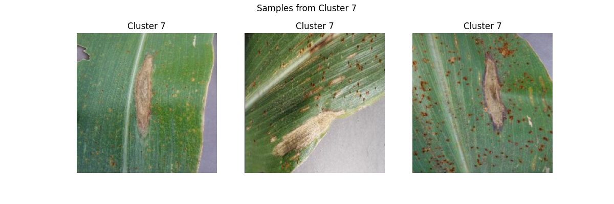
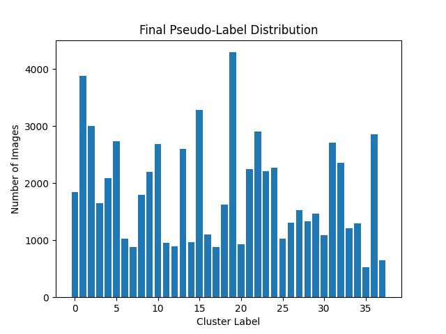
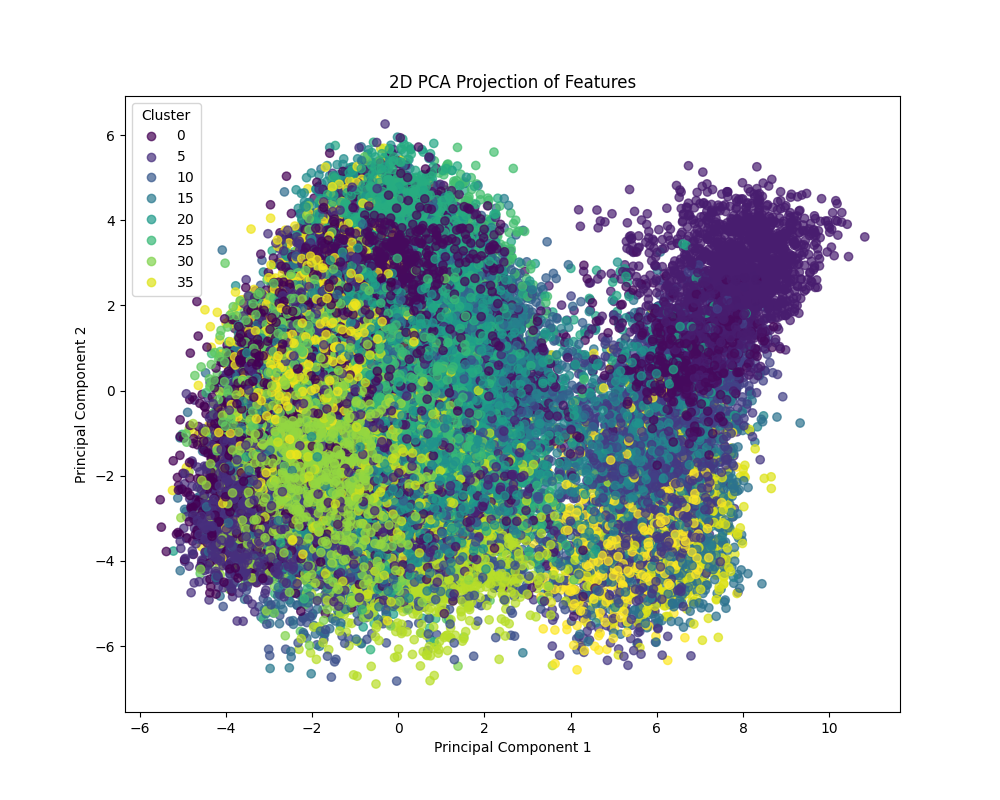

> # Unsupervised Machine Learning for Plant Disease Detection
> 
> ## Github Repository Link
>
> Look under the unsupervised-learning directory.
>
> [Github repository link: https://github.com/DJBlom/cu-boulder-ms-cs](https://github.com/DJBlom/cu-boulder-ms-cs)
>
>
> ## Abstract
> 
> This paper explores the application of unsupervised machine learning methods to the problem of identifying and categorizing plant diseases through visual analysis of leaf images. Early detection of plant diseases is critical for effective agricultural management and reducing crop losses. Utilizing the New Plant Diseases dataset, we employ deep feature extraction using a pretrained ResNet50 neural network, dimensionality reduction through Non-negative Matrix Factorization (NMF), and clustering via KMeans. The effectiveness of these methods is compared with alternative dimensionality reduction techniques and clustering algorithms. Through exploratory data analysis (EDA), we validate feature importance, data correlations, and address necessary data transformations and outlier handling. The findings suggest that unsupervised techniques can effectively cluster images based on visual similarity, highlighting the potential of these methods in agricultural disease detection tasks.
> 
> Keywords: Unsupervised learning, plant disease detection, clustering, dimensionality reduction, ResNet50, KMeans, Non-negative Matrix Factorization (NMF), exploratory data analysis (EDA)
> 
> ## Introduction
> 
> Detecting plant diseases early is essential to minimize agricultural losses and environmental impacts. This research addresses the unsupervised learning task of clustering plant leaf images based solely on visual features. By using clustering, we group images according to similar disease patterns without prior labels, providing valuable insights for further diagnosis and management.
> 
> ## Data Collection and Provenance
> 
> The dataset utilized for this research is the New Plant Diseases dataset, a well-established public resource developed by Penn State University and EPFL. The dataset contains high-quality JPEG images of plant leaves, systematically collected under controlled conditions to ensure consistency and reliability. Each image clearly displays distinct symptoms, making it particularly suitable for automated disease detection. It's important to note that images were captured in a laboratory setting, uniformly positioned against neutral backgrounds to eliminate background noise. Agricultural specialists provided expert labeling, reinforcing the credibility and utility of this dataset for academic and practical applications.
> 
> 
> 
> 
> 
> 
> 
> 
> 
> 
> ## Unsupervised Learning Problem
> 
> The specific problem addressed is the clustering of plant leaf images based on visual characteristics. The aim is to automatically group images without prior knowledge or labels, allowing the discovery of inherent patterns related to different plant diseases. The chosen methods for this study include deep learning-based feature extraction (ResNet50), dimensionality reduction (NMF), and clustering algorithms (KMeans). It's important to note that comparisons with alternative methods like PCA, t-SNE, UMAP, DBSCAN, and hierarchical clustering are considered to evaluate robustness and clustering quality.
> 
> ## Exploratory Data Analysis (EDA)
> 
> The dataset includes images that were converted into high-dimensional feature vectors using the pretrained ResNet50 network. Visualizing the pseudo-label distribution and PCA projections of these features helped assess initial clustering potential.
> 
> Pseudo-Label Distribution visualization indicated varied cluster sizes, highlighting potential visual similarities or redundancies.
> 
> 
> 
> The PCA Scatter Plot demonstrated distinct but overlapping clusters, confirming shared visual features between certain leaf diseases.
> 
> 
> 
> Features extracted via ResNet50 showed inherent correlations, capturing aspects such as texture, color variations, and disease-specific patterns. Techniques like NMF and PCA effectively managed feature correlations and reduced dimensional redundancy. Moreover, data transformations like normalization were generally already addressed through neural network preprocessing; however, additional scaling could enhance stability. Log transformations were considered unnecessary due to the nature of the extracted data. That said, data cleaning confirmed the absence of significant missing data, although outliers or poorly captured images required careful review. Such cases were handled through visual inspection or removal. Furthermore, feature importance analysis indicated that texture, color variance, and lesion patterns were crucial, which were effectively captured by the ResNet50 features.
> 
> ## Model Building, Training, and Comparison
> 
> The primary unsupervised model involved applying KMeans clustering to NMF-reduced features. For baseline comparisons, KMeans clustering was also applied to PCA-transformed features. Alternative clustering methods like DBSCAN and hierarchical clustering were considered for their robustness to cluster shape variations. Additionally, hyperparameter tuning was performed systematically, focusing on optimizing cluster count (k) through the elbow and silhouette methods for KMeans and tuning NMF parameters such as initialization method and iteration count. Moreover, some limitations that I identified included KMeans' assumption of spherical clusters and sensitivity to cluster count, NMF's requirement for non-negative inputs, and PCA's vulnerability to linearity assumptions and outliers. Alternative methods were explored to address these limitations effectively. Finally, evaluation employed metrics such as cluster accuracy, silhouette scores, and cluster purity, guiding objective comparisons of model performance.
> 
> ## Model Improvement Opportunities
> 
> Further enhancements of this unsupervised model could include experimenting with advanced image preprocessing and augmentation techniques to reduce visual noise and improve clustering accuracy. Additionally, semi-supervised approaches leveraging partial labeling or expert feedback could significantly enhance cluster interpretability and real-world applicability. Integrating ensemble clustering methods or deep clustering approaches, such as autoencoders, might also lead to better representation of complex visual patterns present in plant diseases.
> 
> ## Conclusion
> 
> This study effectively demonstrates the potential of unsupervised machine learning in clustering leaf images based on disease characteristics. However, the incorporation of advanced preprocessing techniques, semi-supervised learning, and deeper clustering approaches could substantially improve the accuracy and usability of the model. Furthermore, this study demonstrates the efficacy of unsupervised machine learning methods in clustering plant leaf images to identify and categorize diseases. Deep learning features combined with dimensionality reduction and clustering techniques can effectively reveal inherent visual patterns, aiding early detection and disease management in agriculture.
